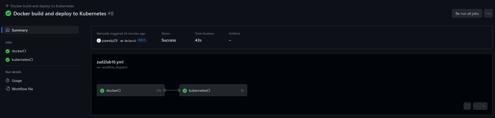

# Aplikacja cloud-app dla Kubernetes
To repozytorium zawiera pliki źródłowe aplikacji *cloud-app* oraz pliki odpowiedzialne za budowanie i wdrożenie obrazu Docker z aplikacją. Pliki manifestów Kubernetes znajdują się w repozytorium [cloud_z2_config](https://github.com/pawelp29/cloud_z2_config).

## Opis działania GitHub Actions

### Zadanie `dockerCI`
Zadanie `dockerCI` buduje obraz Docker aplikacji oraz wysyła go do rejestru DockerHub. Korzysta z następujących zmiennych:
- `secrets.REG_USERNAME` - nazwa użytkownika w rejestrze DockerHub.
- `secrets.REG_PASSWORD` - hasło dostępu (token uwierzytelniający) do rejestru DockerHub.
- `vars.DOCKER_IMAGE` - nazwa obrazu w rejestrze DockerHub, ustawiona na `vicat28/cloud-app`.
- `vars.APP_VERSION` - numer wersji aplikacji, wyświeltany na stronie oraz wykorzystywany do nadania właściwego taga obrazowi.

### Zadanie `kubernetesCI`
Zadanie `kubernetesCI` odpowiada za aktualizację manifestów Kubernetes w repozytorium [cloud_z2_config](https://github.com/pawelp29/cloud_z2_config). Poza opisanycmi wcześniej zmiennymi, korzysta z następujących dodatkowych zmiennych:
- `secrets.CONFIG_REPO_TOKEN` - token dostępowy do repozytorium [cloud_z2_config](https://github.com/pawelp29/cloud_z2_config).
- `vars.GIT_USERNAME` - nazwa użytkownika Git.
- `vars.GIT_EMAIL` - adres email użytkownika Git.

## Proces generowania nowej wersji obrazu Docker
Aby wygenerować nowy obraz aplikacji, należy zmienić wersję aplikacji w zmiennej `vars.APP_VERSION`, a następnie ręcznie uruchomić łańcuch zadań GitHub Actions. Poniższy zrzut ekranu przedstawia przebieg łańcucha:

Link do obrazu na DockerHub: [https://hub.docker.com/r/vicat28/cloud-app](https://hub.docker.com/r/vicat28/cloud-app).